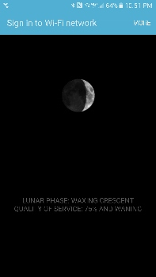

# moonWAP

A moon-phase-driven captive portal created by Tega Brain...

http://tegabrain.com/

This wireless access point is influenced by the phase of the moon. It acts as a captive portal and shows moon-phase information on the mandatory signon screen...

[](screenshots/android-splash.png)

[]((screenshots/thumbs/ios-splash.png))

Wireless parameters reflect the current moon phase....

* signal power waxes and wanes between [full strength 15dBm at New Moon](screenshots/new.png) and [barely connectible 0dBm at Full Moon](screenshots/full.png)
* SSID adapts to show an apropriate unicode moon emodicon


# Setup Instructions 

## Assumes

1. You have this router with factory installed standard OpenWRT image... 

  http://amzn.to/1ThS6xZ

2. The router is connected to the internet via the WAN port. 
3. You have a laptop with SSH on it that can connect to the router over Wifi. 

## Setup

1. Press and hold the reset button for 8 seconds to reboot the router to factory default state
2. Wait for the AP to come back up and connect to it over Wifi (default password is "goodlife")
3. Navigate to 192.168.8.1
4. Set new password
5. Wait for the AP to come back up and connect to it with the new password
6. If you want this to be an open access point, remove Wifi security under `Advanced Settings->Network>-Wifi->Edit->Wireless Security->Encryption->No Encryption`. Be sure to hit `Save & Apply`.
6. SSH to 192.168.8.1 and log in with the new password
7. Enter this command...  

  ```
opkg update
``` 

  ... to get the package manager ready for the installs we are about to do.

7. Enter this command...  

  ```
opkg install wireless-tools
``` 

  ... to get the `iwconfig` command that we will use to dynamically adjust the wifi signal strength. (I know we should be able to use just `iw`, but it doens't seem to work.)

8. Enter these comands...

  ```
opkg install nodogsplash
/etc/init.d/nodogsplash enable
```
  ...to install the nodogsplash package and enable it to run automatically on boot. 
  
7. Copy the contents of `/etc` of this repo to the `/etc` directory on the device. I use SCP. 

8. Run the install script...

  ```
cd /etc/moonWap
chmod +x install.sh
./install.sh
```
  ...to install the `moonWAP` configuration.
  
9. Reboot to start `nodogsplash`.
  
## Enable Weaved for remote SSH access (optional)
1. Get and install the `Weaved` tarball...

  ```
   wget -O git://github.com/weaved/installer/raw/master/binaries/weaved-OpenWRT-9331-0.94.tar`
   tar -xvf weaved-OpenWRT-9331-0.94.tar
   cd weaved
   ./install.sh
   rm /etc/init.d/weavedWEB
  ```

  Note that we are disabling the Weaved WEB proxy since we only care about SSH access.
  
2. Log into the Weaved website and wait for this new machine to show up under services. 

## TODO

1. Right now nodogsplash does not do anything to DNS requests, so the access point *must* have an internet connection or else the initial probe will fail and the user will not see the login screen. Might be nice to catch these DNS requests and serve them locally. 
2. Might be nice to animate the moon and signal strength localy in javascript.
